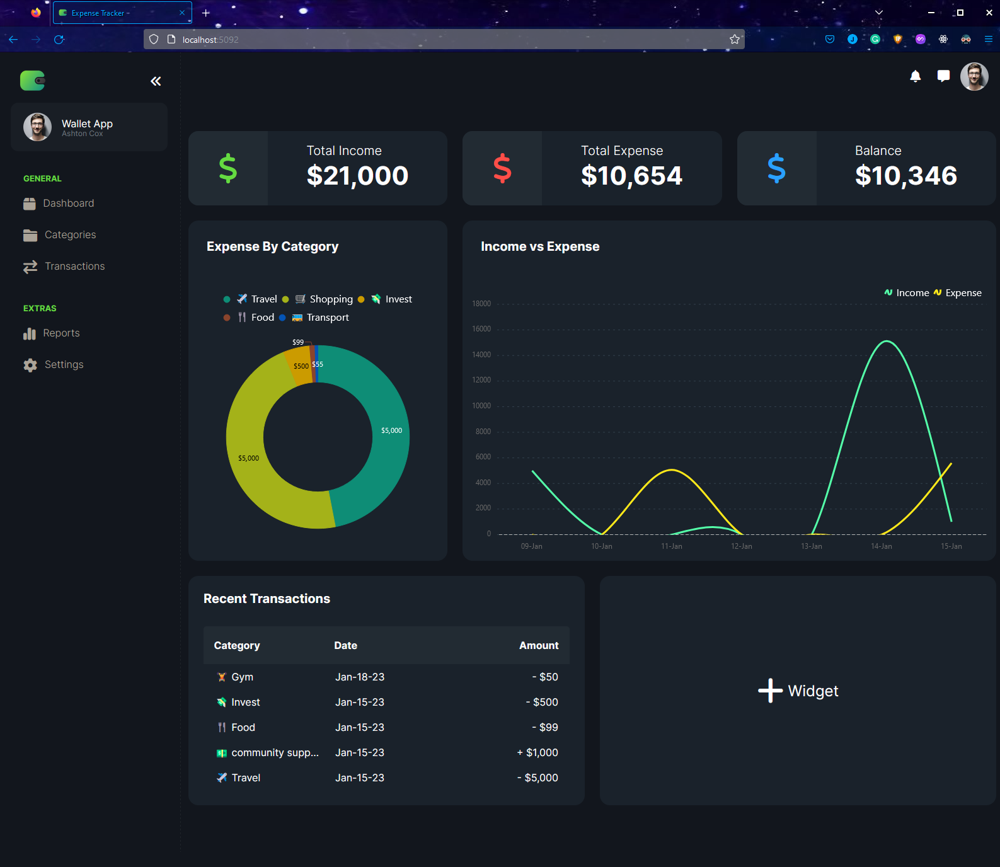
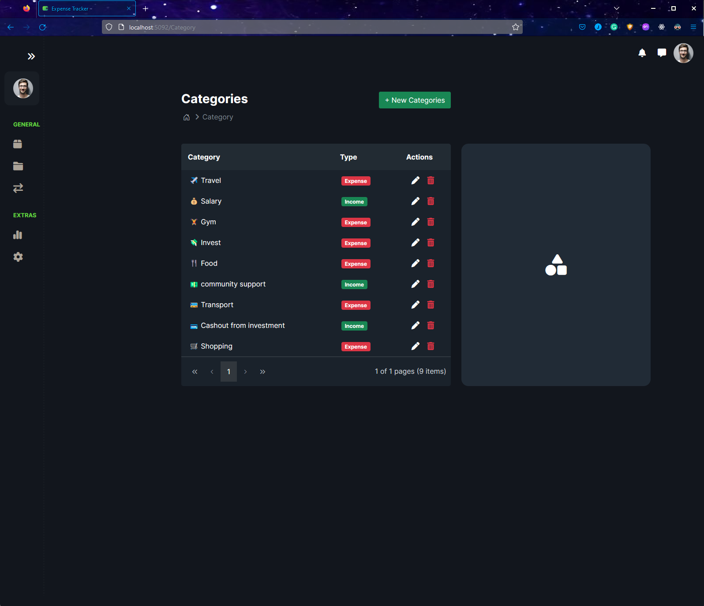
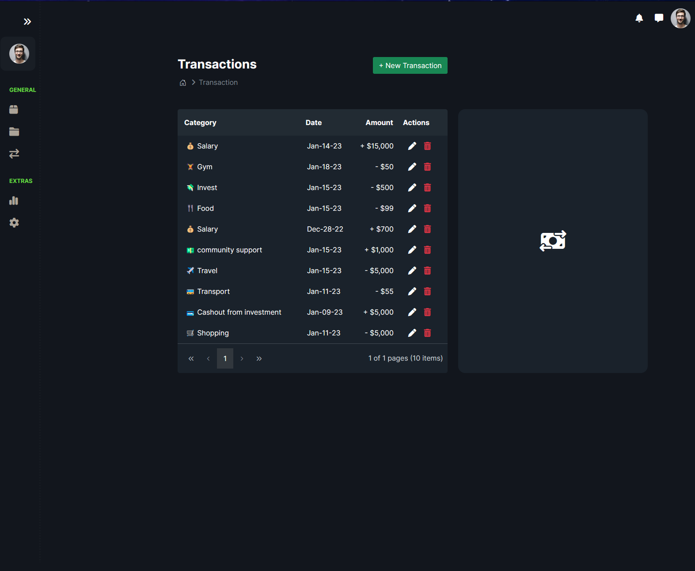

# Expense-Tracker

In this project, I build a new expense tracking app from the beginning using Asp.Net Core 7 and the SyncFusion Component/ Boostrap 5 Library. The goal is to learn how to develop an enterprise-level application with these tools.

Dashboard Page

Category Page

Transaction Page

